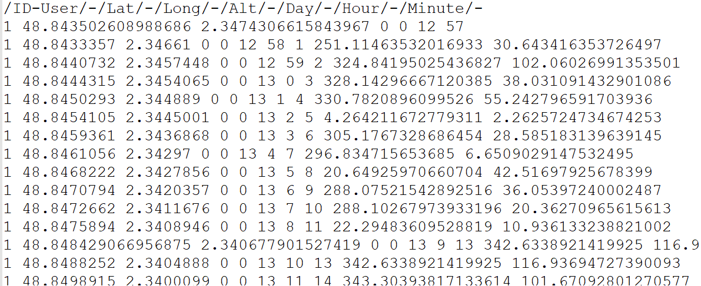

# COVID-19 Risk Estimation
This repository contains the work conducted by Sedevizo Kielienyu for community risk estimation of COVID-19 under the supervision of Dr. Burak Kantarci. The project is inspired by the ubiquitous and non-dedicated nature of mobile sensors, where a suitable Mobile Crowdsensing (MCS) campaign is used to collect the mobility pattern of smart mobile device users (individuals who have opted to provide their sensory data to the MCS campaign). These individuals are called MCS participant or simply a user. Documentation of the Python codes are generated using Sphinx, and can be found under the 'Documentation/Python/\_build/html/' folder. In addition to this, comments are provided in within certain lines of codes for an easier workaround with various functions. To view the documentation, open 'index.html' in the location mentioned earlier. All the Python codes can also be found undet the same directory. The project uses CrowdSenSim1, a virtual crowdsensing environment to collect the mobility patterns of the MCS participants.  
To view the documentation in your system, you need to install 'Sphinx' as well as 'autodoc' using pip, i.e., pip install sphinx, pip install autodoc  

Details regarding the simulation settings, clustering methods, raw data, and output files of the code are given below, along with the pre-requisites that is required for this project:

1. **Pre-requisites**:
  Programming Language: The baseline programming language is Python, which is used to create all the functions regarding the proposed COVID-19 risk estimation. For plotting the   graphs, MATLAB is used. 
  
    Python version: 3.8.4  
    MATLAB version: R2020a  
    CrowdSenSim version: [1.2.0](https://crowdsensim.gforge.uni.lu/download.html)    
    Python libraries: Here, the libraries(modules) used for this project are listed.  
    &nbsp;&nbsp;&nbsp;a. pandas  
    &nbsp;&nbsp;&nbsp;b. numpy  
    &nbsp;&nbsp;&nbsp;c. hmmlearn  
    &nbsp;&nbsp;&nbsp;d. sklearm    
    &nbsp;&nbsp;&nbsp;e. time  
    
2. **Simulation Settings, Clustering parameters, other parameters**:  
  **CrowdSenSim**  
  Data collection framework: PCS (Piggyback Crowdsensing)    
  Time interval of the MCS campaign (min-max): 20 - 120 mins      
  Day(s) of simulation: 1  
  Number of users: 10000 (scenario 1), 30000 (scenario 2)  
  City: Paris (area: 105.4 km2  
  Selected travel time of each user: 41 mins (41 mins of travel time is selected from each user to define the travel distance, i.e., mobility pattern)  
  **Clustering parameters**  
  Clustering method: k-means, HMM (Hidden Markov Model), EM (Expected Maximization)  
  Number of clusters: 5, 6, 7, 8    
  **Other parameters**  
  For estimating the risk scores of each cluster, a t% ahead mechanism is used where an estimation of future risk of a cluster is evaluated with (1-t)% of the time commitments of each user in the MCS campaign. The t% ahead mechanism is known as the 'Foresight' in this risk study.   
  Foresight: 20% - 50% ahead    
  20% ahead means 80% of the mobility pattern of each user. Likewise, 50% means 50% of the mobility pattern of each user.
3. **Raw Data**:
  The raw data (mobility pattern), obtained from the simulator, contains 7 features defined by the tuple <UserID, Latitude, Longitude, Altitude, Day, Hour, Min>. The mobility pattern can be found in each of two sub-folders under 'Raw Data' folder, representing the two scenarios. Each folder is labelled by 'City-Users-Day'. Here is a snippet of the raw data.

4. **Output files**:
  All the output files are stored in the 'Output' folder. The raw data is cleaned using Microsoft Excel, where all the null values in each cell is replaced with 0. Since 'Altitude' feature is not required to determine the geo-location of a user, it can be discarded. Following a feature selection method, 'Day' feature is also discarded. The final tuple becomes <UserID, Latitude, Longitude, Hour, Min, Sec>. Please read the 'Output_tuples.txt' in the 'Output' folder to get an explanation on each feature/column of the different data set. It is recommended to read the description of the output files first before reading the .txt file.  
  
    Details of the output files:  
    &nbsp;&nbsp;&nbsp;1. **UserMovementListEvents_0_Users.csv**: This file is the cleaned version of the raw mobility data from the result of replacing null values and feature selection. 'Users' in the file name can be either 10000 or 30000. For example; UserMovementListEvents_0_10000.csv    
    &nbsp;&nbsp;&nbsp;2. **paris_Users_Foresight.csv**: This file contains the t% ahead mobility data following the data-processing steps. An example of the file name; paris_10k_50p.csv. Since the selected travel time is 41 mins, the t% ahead is taken from the mobility data where all the users have the same number of mobility instances.    
    &nbsp;&nbsp;&nbsp;3. **tsne_Users_Foresight.csv**: This file is 2D vector resulted from the dimentionality reduction using t-SNE2. For example; tsne_10k_50p.csv   
    &nbsp;&nbsp;&nbsp;4. **labels_ClusterNum_Foresight_ClusteringMethod.csv**: This file contains the labels from the 2D t-SNE vector with a particular clustering algorithm. For example; labels_5_50p_em.csv (em for EM, km for k-means, hmm for HMM)  
    &nbsp;&nbsp;&nbsp;5. **contact_list_ClusterNum_Foresight_ClusteringMethod.csv**: This file contains the contact list of an instance (geo-location) of a user in a cluster from either of the three identified clustering algorithms. An example of the filename; contact_list_5_50p_em.csv  
    &nbsp;&nbsp;&nbsp;6. **cluster_riskfactor_ClusterNum_Foresight_ClusteringMethod.csv**: This file contains the risk factor of a cluster. An example of the filename; cluster_riskfactor_5_50p_em.csv    
    &nbsp;&nbsp;&nbsp;7. **risk_factor_ClusterNum_Foresight_ClusteringMethod.csv**: This file contains the risk factor of every instance of all users in the monitored region. An example of the file name; risk_factor_5_50p_em.csv  
    &nbsp;&nbsp;&nbsp;8. **user_count_ClusterNum_Foresight_ClusteringMethod.csv**: This file contains the number of unique users in each cluster. An example of the file name; user_count_5_50p_em.csv  
    &nbsp;&nbsp;&nbsp;9. **max_risk_factor_ClusterNum_Foresight_ClusteringMethod.csv**: This file contains the highest risk factor in each cluster. The highest risk factor will be the risk factor of an instance of a user who has the maximum list of participants in its contact list. An example of the file name; max_risk_factor_5_50p_em.csv  
    &nbsp;&nbsp;&nbsp;10. **std_riskfactor_ClusterNum_Foresight_ClusteringMethod.csv**: This file contains the standard deviation of the cluster's risk factor. An example of the file name; std_riskfactor_5_50p_em.csv  
    &nbsp;&nbsp;&nbsp;11. **merged_list_ins_cl_ClusterNum_Foresight_ClusteringMethod.csv**: This file is a merged csv file between output file 2, 4, and 5. An example of the file name; merged_list_ins_cl_5_50p_em.csv  
    &nbsp;&nbsp;&nbsp;12. **error_values.csv**: This file contains the average dependability of different number of communities for diiferent clustering methods at different foresights. The average dependability is the average of the summation of the absolute difference between the actual risk factor and the predicted risk factor for M communities/clusters.  
    &nbsp;&nbsp;&nbsp;13. **min_error_value.csv**: This file contains the the maximum dependability from the identified clustering methods at a particular foresight with M communities/clusters.   
    
5. **Additional Information**:
A Google Drive link has been created to get additional output files. Apart from the Python codes, the files in this repository only represents a segment of the generated output files, but it is sufficient enough to understand the output from each Python code. The Google drive link can only be access by a student or a faculty of uOttawa. This authorization can be ammended by sending an email to me (skiel067@uottawa.ca) and Dr. Burak Kantarci (burak.kantarci@uottawa.ca) for an access request. **Note**: Apart from downloading, please do not modify the contents within the Google Drive shared folder.   
I hope I have provided sufficient information to help you understand the work that has been done here. If there is any question regarding the code(s), please feel free to send me an email at skiel067@uottawa.ca  
Google drive link:  
Happy Researching!:)  

## References
1. [Fiandrino, Claudio, et al. "CrowdSenSim: a simulation platform for mobile crowdsensing in realistic urban environments." IEEE Access 5 (2017): 3490-3503.](http://www.cs.toronto.edu/~hinton/absps/tsnefinal.pdf)
2. [Maaten, Laurens van der, and Geoffrey Hinton. "Visualizing data using t-SNE." Journal of machine learning research 9.Nov (2008): 2579-2605.](https://ieeexplore.ieee.org/stamp/stamp.jsp?arnumber=7859284)
  

